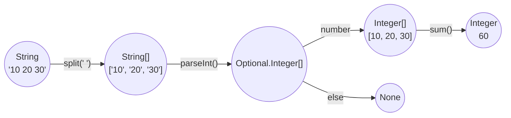

---
# try also 'default' to start simple
theme: seriph
# random image from a curated Unsplash collection by Anthony
background: https://cover.sli.dev
# some information about your slides, markdown enabled
title: Introduction of Function Programming
# apply any unocss classes to the current slide
class: text-center
# https://sli.dev/custom/highlighters.html
highlighter: shiki
# https://sli.dev/guide/drawing
drawings:
  persist: false
# slide transition: https://sli.dev/guide/animations#slide-transitions
transition: slide-left
fonts:
  mono: "Moralerspace Argon HW"
# enable MDC Syntax: https://sli.dev/guide/syntax#mdc-syntax
colorScheme: light
mdc: true
---

# 関数型プログラミング入門

<div class="pt-12">
  <span @click="$slidev.nav.next" class="px-2 py-1 rounded cursor-pointer" hover="bg-white bg-opacity-10">
    currentPage.next().show()
  </span>
</div>

---

# 関数型プログラミング

## 学ぶ利点

<br>

1. コードのバグを埋め込みづらくする**堅牢な**プログラムをかける。
2. 他の言語のパラダイムでも使える普遍的な考え方を学べる。

<br>

## 代表的な言語

<br>

- Lisp(1960年) - カッコがいっぱい出てくるやつ (神の言語...らしい)
- Haskell(1990年) - 純粋関数型プログラミングの代表的なプログラミング言語
- Scala(2001年) - JavaのVM上で動く言語


その他にも様々な言語やフレームワークが関数型プログラミング影響を受けている(Reactとかもそうだよ)

---

# 関数型プログラミングのイメージ

## 型と関数の連続

例：

"20 30 10 20 30"のような空白区切りの数値をすべて足した結果を出力しよう

<br>




---

# 余談ですが...

## 型から関数を検索するサイトがある

[Hoogle](https://hoogle.haskell.org/) : Haskellの関数を型から調べられる

型がその関数の重要な部分だとわかりますね！

---
layout: statement
---

# 宣言的プログラミング
# イミュータブル
# 純粋関数

<style>
  h1 {
    text-align: left;
    padding-left: 110px;
  }

  h2 {
    text-align: left;
    padding-left: 110px
  }
</style>
<br>

## これらを理解する

---

# 宣言的プログラミング

<style>
  h2 {
    text-align: center;
  }
</style>

##

<span class="text-2xl text-orange font-bold">How</span> ではなく <span class="text-2xl text-blue font-bold">What</span> でプログラミングする考え方，パラダイム

<br>

<div class="grid grid-cols-2 gap-4">

<div>

## 命令的プログラミング

<br>

- 「どのように」行うかに焦点を当てる
- ステップバイステップの手順を明示的に記述
- ループ、条件分岐などの制御構造を多用
- コードが長くなる傾向がある
- 低レベルの操作を直接制御できる

</div>
<div>

## 宣言的プログラミング

<br>

- 「何を」行うかに焦点を当てる
- 目的を高レベルな関数や式で表現
- map, filter, reduceなどの関数型の特徴を活用
- コードが簡潔になる傾向がある
- 抽象化によりバグが減り、読みやすくなる

</div>
</div>

---

# 宣言的プログラミング　例


<style>
  h2 {
    text-align: center;
  }
</style>

<br>

<div class="grid grid-cols-2 gap-4">

<div>

## 命令的プログラミング

<br>

```javascript{all|7-8|9-10|13-16|all}
const foods = [
  {name: "りんご", price: 50, num: 2},
  {name: "バナナ", price: 80, num: 3},
  {name: "スイカ", price: 150, num: 1}
];

// 合計値を変化するものとして定義している
let sum = 0;
// 合計を求めるとき本来は不必要なiを定義している
for (let i = 0; i < foods.length; i++) {
  const food = foods[i];

  if (food.price <= 100) { // 百円以下のとき
    // 合計値に一つの食べ物の合計価格を足す
    sum += food.price * food.num;
  }
}
```

</div>
<div>

## 宣言的プログラミング

<br>

```javascript{all|7-8|9|10|11}
const foods = [
  {name: "りんご", price: 50, num: 2},
  {name: "バナナ", price: 80, num: 3},
  {name: "スイカ", price: 150, num: 1}
]

// 合計値を変化しないものとして定義している
const sum = foods
  .filter(food => food.price <= 100) // 百円以下のものだけ取り出す
  .map(food => food.price * food.num) // 一つの食べ物の合計価格を計算
  .reduce((x, y) => x + y); // それらの合計を求める
```
</div>
</div>


---

# イミュータブル (Immutable)

## 一度定義したら絶対に変化しない値

対義語はミュータブル(mutable)

<div v-click>

## え...変化してもええじゃん？

</div>
<div v-click>

いやいや、変化するといろんなことが難しくなる

- コードを追うのが難しくなる
- 意図しない挙動をしやすくなる
- テストがしづらくなる
- キャッシュが使いづらくなる
- 並行処理が難しくなる
- map, filter, reduceなど，関数型プログラミングの便利関数と相性が悪い

などなど...

</div>

---

# イミュータブル　例

<style>
  h2 {
    text-align: center;
  }
</style>

<div class="grid grid-cols-2 gap-4">
<div>

## ミュータブル

```java{all|2-3|10-17|18-21|all}
public class Food {
  private String name;
  private int price;

  public Food(String name, int price) {
    this.name = name;
    this.price = price;
  }

  public void setName(String name) {
    this.name = name; // まさに内部状態を変更している
  }

  public void setPrice(int price) {
    this.price = price; // まさに内部状態を変更している
  }

  public void discount(double rate) {
    // 戻り値がない/内部状態を変更
    setPrice((int)(this.price * (1 - rate)));
  }
}
```

</div>
<div>

## イミュータブル

```java{all|2-3|10-14|all}
public class Food {
  public final String name; // final 修飾子は再代入を禁止する
  public final int price; // フィールドはpublicへ

  public Food(String name, int price) {
    this.name = name;
    this.price = price;
  }

  public Food discount(double rate) {
    // 新たなインスタンスを作って返す
    // つまり this != return value
    return new Food(this.name, (int)(this.price * (1 - rate)));
  }
}

// こちらだと下のようにメソッドチェーンでかける
new Food("りんご", 100).discount(0.2).price // 80
```

</div>
</div>

---

# 純粋関数

- 関数の主作用以外の作用（**副作用**）を持たない関数
- 引数が同じなら同じ結果を返す（**参照透過性**）

<style>
  h2 {
    text-align: center;
  }
</style>

<br>

<div class="grid grid-cols-2 gap-4">
<div>

## 副作用を持つ関数

```javascript
const lst = [2];

function add(lst) {
  lst.push(Math.floor(Math.random() * 3));
  return lst;
}

const result = add(lst);

console.log(lst); // [2, 1]
console.log(result); // [2, 1]
// 外の世界のlstに影響を及ぼしている（副作用）
// また，同じ引数でも同じ結果が返ってくるとは限らない
console.log(add([2])) // [2, 0]
```

</div>
<div>

## 純粋関数

```typescript
const lst = [2];

function add(lst) { // 純粋関数
  return lst.concat([1]);
}

const result = add(lst);

console.log(lst); // [2]
console.log(result); // [2, 1]
// 外の世界に影響を及ぼさない（副作用がない）
// 引数が同じなら常に同じ値を返す（参照透過性）
```

</div>
</div>

---
layout: statement
---

# これらを踏まえて練習問題へ
